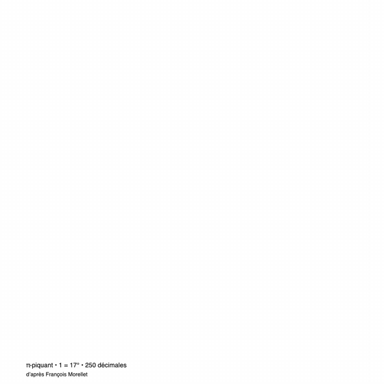
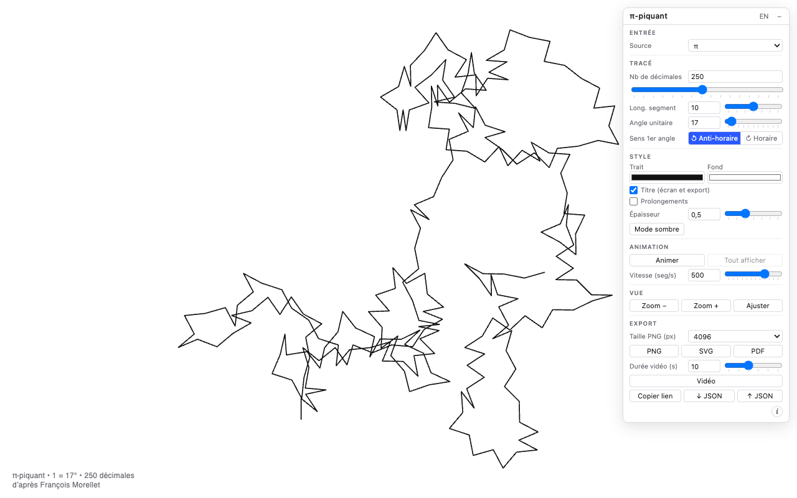
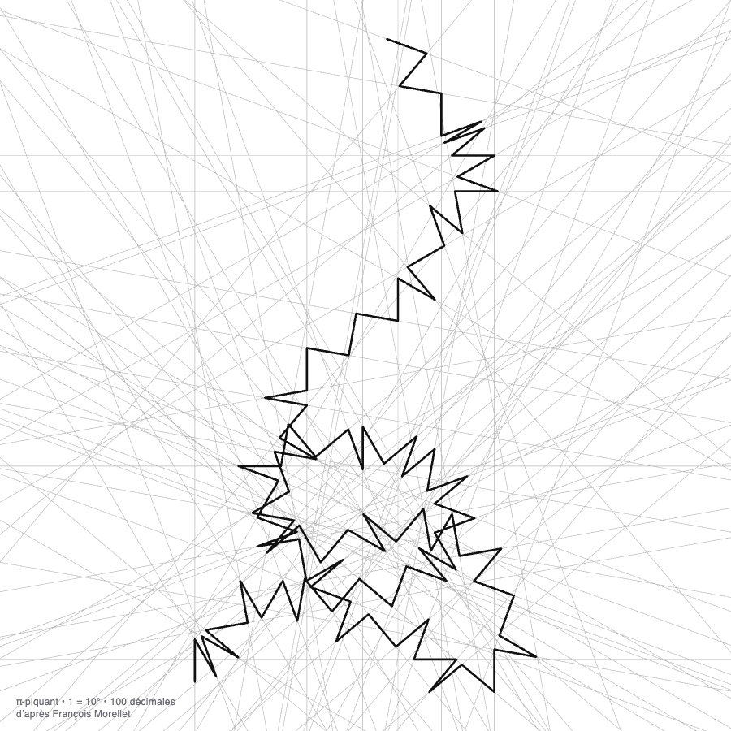
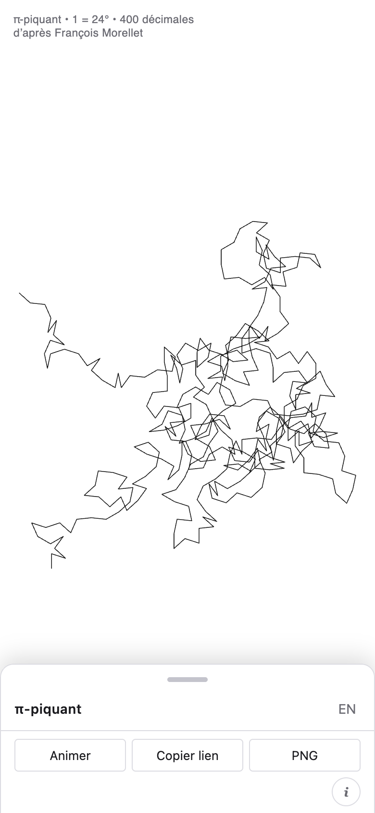
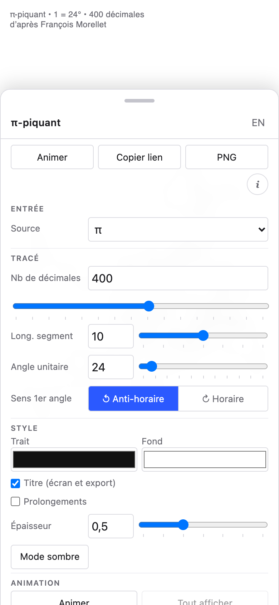
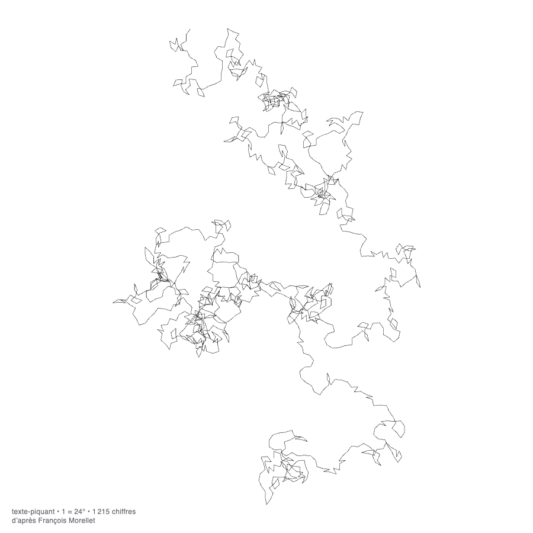

# π-piquant

[](https://gitlab.com/charlescoiffier/pi-piquant/-/pipelines)

Une application web qui transforme une suite de chiffres (les décimales de π par défaut) en un dessin de
lignes brisées, d'après la série « pi-piquant » de François Morellet.

**Essayer l'application : https://pi-piquant-b69e0d.gitlab.io/**

Aucune installation : tout se passe dans le navigateur, et rien n'est envoyé à un serveur.

## Aperçu



| Sur ordinateur | Avec les prolongements des segments |
|---|---|
|  |  |

| Sur téléphone | Réglages sur téléphone | Un texte devient un dessin |
|---|---|---|
|  |  |  |

---

# Pour tout le monde

## Le projet en bref

François Morellet (1926–2016) était un artiste français qui composait ses œuvres à partir de règles simples,
appliquées sans intervention de sa main ni de son goût, et souvent avec humour. Dans sa série *pi-piquant*, la règle
est la suivante : on trace des segments de même longueur, et ce sont les **décimales de π** (3,14159265…) qui
décident de l'angle entre deux segments consécutifs. Le hasard apparent du nombre π donne des figures en étoile,
à la fois rigoureuses et imprévisibles.

Cette application applique le même principe, puis l'ouvre à d'autres suites de chiffres : d'autres nombres célèbres,
un texte ou une image. Elle ne remplace pas les œuvres, c'est une réinterprétation : chaque dessin porte d'ailleurs
la mention « d'après François Morellet ». Pour découvrir son travail : [francoismorellet.com](https://francoismorellet.com/).

## Comment un dessin se construit

1. Le premier segment est toujours **vertical**, tracé vers le haut.
2. Chaque chiffre donne l'**angle** entre le segment qui vient d'être tracé et le suivant :
   *angle = chiffre × angle unitaire*. Un angle de 0° ramènerait le segment sur le précédent ; le chiffre 0 compte
   pour **10** (comme dans l'œuvre), pour que chaque chiffre produise un angle différent.
3. Le **sens** de l'angle s'inverse à chaque sommet (un angle d'un côté, le suivant de l'autre), ce qui donne le
   caractère « piquant » de la ligne.
4. Tous les segments ont la même longueur.

Exemple avec π (3, 1, 4, 1, 5, 9…) et un angle unitaire de 10° : les premiers angles sont 30°, 10°, 40°, 10°, 50°,
90°… Le titre sous chaque dessin le rappelle : « π-piquant • 1 = 10° • 100 décimales ».

## Utiliser l'application

L'écran est blanc, avec une petite fenêtre de réglages que l'on peut **déplacer**, **replier** (bouton « – ») ou
**masquer** (touche `H`). Le bouton « i » en bas de la fenêtre ouvre une courte présentation de Morellet.

- **Naviguer dans le dessin** : molette ou pincement pour zoomer, glisser pour se déplacer, « Ajuster » pour
  tout recadrer.
- **À l'ouverture**, le nombre de décimales (entre 10 et 200) et l'angle unitaire (entre 1° et 90°) sont tirés au
  hasard : chaque visite propose un dessin différent.
- **Langue** : français ou anglais (bouton FR/EN en haut de la fenêtre).
- **Sur téléphone**, la fenêtre devient une **feuille en bas de l'écran**, à trois positions :
  **fermée** (seule la poignée est visible, aucun bouton : le dessin occupe tout l'écran), **mi-ouverte** (titre, langue,
  trois actions rapides — Animer, Copier lien, PNG — et ligne d'état) et **ouverte** (tous les réglages, qui défilent).
  Toucher la poignée l'ouvre à moitié, puis complètement. On peut aussi la faire glisser : un **petit** glissement
  vers le haut l'ouvre d'un cran, un petit glissement vers le bas la ferme d'un cran (de mi-ouverte à fermée, d'ouverte à
  mi-ouverte), un **grand** glissement vers le bas la ferme d'un coup. Les commandes sont agrandies pour le tactile, et
  le pincement zoome comme sur ordinateur.
- **Version** : le bouton « i » affiche aussi la version de l'application, le commit correspondant et la date de
  construction (pratique pour vérifier quelle version est en ligne).

### Ce que l'on peut dessiner (« Source »)

| Source | Ce que ça fait |
|---|---|
| **π**, **e**, **φ** (nombre d'or), **√2** | Les décimales de ces nombres, jusqu'à 100 000. |
| **Chiffres** | Une suite de chiffres de son choix (une date, un numéro…). Les autres caractères sont ignorés. |
| **Texte** | N'importe quel texte (accents, autres alphabets, emojis) devient une suite de chiffres. |
| **Image** | Une image devient une suite de chiffres (niveaux de gris), lue selon un parcours au choix : lignes, serpentin, spirale ou courbe de Hilbert. |

Pour le texte et l'image, la conversion est **réversible** : le dessin contient toute l'information, et en
théorie on peut retrouver le texte ou l'image à partir des chiffres (voir la partie technique). Le texte ou l'image est
toujours utilisé en entier, sans réglage du nombre de décimales.

### Les réglages

| Réglage | Effet |
|---|---|
| Nb de décimales | Combien de chiffres sont tracés (π, e, φ, √2) : de 1 à 100 000. |
| Long. segment | Longueur des segments (de 1 à 100). Elle modifie surtout l'épaisseur apparente du trait. |
| Angle unitaire | L'angle qui correspond au chiffre 1 (de 0° à 360°) ; c'est le réglage qui change le plus l'allure du dessin. |
| Sens 1er angle | Anti-horaire (comme dans l'œuvre) ou horaire : donne l'image miroir. |
| Trait, Fond, Épaisseur | Couleurs et épaisseur de la ligne ; un bouton « Mode sombre » inverse fond et trait. |
| Titre | Affiche ou masque la légende sous le dessin (à l'écran et dans les exports). |
| Prolongements, Intensité | Prolonge chaque segment en une fine droite grise qui traverse tout l'écran, comme sur l'estampe de référence ; l'intensité règle la force de ce gris (de 5 à 100 %). Les prolongements suivent aussi l'animation et sont présents dans les exports. |
| Animation | « Animer » dessine le tracé segment par segment (de 1 à 5000 segments par seconde) ; « Tout afficher » termine l'animation. |

Les curseurs ont des **crans** (petits repères sous la piste) pour retrouver facilement des valeurs courantes, et chaque
champ numérique accepte aussi une valeur précise saisie au clavier.

### Enregistrer et partager

- **PNG** (2048, 4096 ou 8192 pixels), **SVG** (dessin vectoriel, agrandissable sans perte) et **PDF** (A4).
  Les fichiers portent un nom explicite, par exemple `pi-piquant_10deg_100dec.png`.
- **Vidéo** : enregistre l'animation du dessin en **MP4** (ou **WebM** selon le navigateur), 1080 pixels sur le grand
  côté, légende comprise. On choisit la **durée** (de 3 à 60 secondes) : elle remplace la vitesse d'animation pour
  l'enregistrement, donc un dessin de 100 000 segments tient aussi dans 10 secondes. Le bouton devient « Annuler »
  pendant l'enregistrement, qui se fait en temps réel ; mieux vaut garder l'onglet visible.
- **Copier lien** : le lien reproduit le même dessin chez la personne qui l'ouvre. Il est **lisible** et contient les
  réglages du dessin (source, décimales, longueur du segment, angle unitaire, sens du premier angle, couleurs du trait
  et du fond, épaisseur, prolongements), par exemple
  `…/#source=pi&decimales=100&segment=10&angle=10&sens=anti-horaire&trait=111111&fond=ffffff&epaisseur=0.5&prolongements=non`.
  Il ne contient ni l'animation, ni la langue, ni l'affichage du titre (préférences personnelles), ni l'image si la
  source en est une. On peut le modifier à la main. La barre d'adresse affiche ce lien et revient à l'adresse courte
  dès qu'un réglage change.
- **Ouvrir un lien** : coller un lien dans la barre d'adresse (même sur la page déjà ouverte), ou faire Cmd/Ctrl + V
  dans la page (hors d'un champ de saisie), applique ses réglages sans changer ta langue, ta vitesse d'animation ni l'affichage du titre.
- **JSON** : enregistrer les réglages dans un fichier (↓ JSON) puis les rouvrir plus tard (↑ JSON).

### Limites

- 100 000 chiffres au maximum par dessin.
- Texte : environ 33 000 octets (une lettre ordinaire = 1 octet, une lettre accentuée = 2, un emoji = 4).
- Image : environ 33 000 pixels ; une image plus grande est réduite automatiquement à l'import (le message en bas
  de la fenêtre l'indique).
- Prolongements : limités aux 5 000 premiers segments (un message le signale), car au-delà ils ne se distinguent plus.
- Vidéo : nécessite un navigateur récent (Chrome, Edge, Safari ou Firefox à jour) ; les vidéos de très grands
  dessins demandent un ordinateur correct.
- Pour retrouver le contenu depuis le dessin, l'angle unitaire doit rester **inférieur ou égal à 36°** : au-delà,
  des chiffres différents donnent le même angle (à 90°, les chiffres 1, 5 et 9 sont identiques).

---

# Pour les développeurs

## Démarrage

Prérequis : Node.js 22 ou plus récent.

```bash
npm install
npm run dev        # serveur de développement (http://localhost:5173)
npm test           # tests unitaires (Vitest)
npm run build      # vérification des types + build de production dans dist/
npm run preview    # sert le build de production
npm run generate:digits   # régénère src/data/digits.json (100 000 chiffres de π, e, φ, √2)
npm run capture:readme    # régénère les images du README (docs/images/) : Chrome et ffmpeg requis
```

Pour la régénération des données, `npx vite-node scripts/generate-digits.ts --verify` recoupe en plus π avec
l'API pi.delivery à quatre positions.

## Technologies

TypeScript + [Vite](https://vite.dev/), sans framework : rendu **Canvas 2D**, interface en DOM natif.
[Vitest](https://vitest.dev/) pour les tests, [jsPDF](https://github.com/parallax/jsPDF) pour l'export PDF
(chargé à la demande), `MediaRecorder` (natif) pour l'export vidéo, [puppeteer-core](https://pptr.dev/) pour générer
les images du README. Application 100 % statique, aucun serveur.

## Organisation du code

| Dossier / fichier | Rôle |
|---|---|
| `src/main.ts` | Orchestration : état, recalcul, animation, zoom, exports, lien de partage, messages d'état. |
| `src/geometry/path.ts` | Règle de tracé (fonction pure) : chiffres → points. |
| `src/geometry/extend.ts` | Prolongements (fonctions pures) : droite infinie ∩ rectangle (`clipLine`), prolongement de chaque segment (`extendedLines`). |
| `src/digits/` | Sources de chiffres → `Uint8Array` de 0 à 9. `embedded.ts` (fichier JSON embarqué), `pi.ts` (API pi.delivery + cache IndexedDB, en secours), `constants.ts` (e, φ, √2, π calculés en BigInt), `free.ts`, `text.ts`, `image.ts`, `bytecode.ts` (octet ⇄ 3 chiffres). |
| `src/render/` | `canvas.ts` (dessin, prolongements), `viewport.ts` (zoom, déplacement, pincement, cadrage), `export.ts` (PNG, SVG, PDF, JSON ; `paintExport` commun au PNG et à la vidéo), `video.ts` (enregistrement vidéo). |
| `src/ui/` | `panel.ts` (fenêtre de réglages et feuille mobile), `info.ts` (modale « À propos »), `i18n.ts` (FR/EN), `state.ts` (paramètres, bornes, lien), `title.ts` (légende et noms de fichiers), `version.ts` (version affichée), `layout.ts` (seuil mobile). |
| `src/data/digits.json` | 100 000 chiffres de π, e, φ, √2 (400 Ko), généré par `scripts/generate-digits.ts`. |
| `scripts/` | `generate-digits.ts` (données), `capture-readme.mjs` (images du README). |
| `docs/images/` | Captures et GIF du README (générés par `npm run capture:readme`). |
| `tests/digits.test.ts` | Tests : géométrie, prolongements, constantes, conversions, aller-retour texte/image, titre, paramètres et lien, version, tracé progressif. |

## Données de π et des constantes

Les 100 000 premiers chiffres de π, e, φ et √2 sont **embarqués** dans `src/data/digits.json` (chargé à la demande, donc
absent du premier chargement de la page). L'application fonctionne ainsi hors ligne et sans attente. L'API
[pi.delivery](https://pi.delivery/) (1000 chiffres par requête, mis en cache dans IndexedDB) et le calcul local en BigInt
ne servent que de secours si le fichier est indisponible. Les suites commencent par le chiffre entier : `3141592653…`,
`2718281828…`, `1618033988…`, `1414213562…`.

## Règle de tracé

`buildPath` (`src/geometry/path.ts`) : premier segment vertical vers le haut ; pour chaque chiffre `d`, le cap tourne de
`180° ± (d || 10) × angleUnitaire` (le signe s'inverse à chaque sommet, le premier suit le réglage « Sens 1er angle »), puis
on avance d'un segment. *n* chiffres donnent donc *n + 1* segments. L'épaisseur du trait est exprimée en unités du dessin
(avec un minimum de 0,4 px à l'écran), pour que le dessin reste identique à toutes les échelles.

## Prolongements des segments

Chaque segment est prolongé en droite infinie, découpée par la zone visible (`clipLine`, méthode de Liang-Barsky, dans
`src/geometry/extend.ts`). `drawPath` (`src/render/canvas.ts`) les trace **avant** le tracé, en un seul chemin, avec un gris
obtenu en **mélangeant le trait et le fond** (`mixColor`) plutôt qu'avec de la transparence : le rendu est identique à l'écran,
en PNG, en SVG (un `<path>`) et en PDF. Épaisseur : le quart de celle du trait. Dans les exports, les droites sont
découpées par la zone du dessin et ne traversent pas la légende. Plafond : `EXTEND_MAX_SEGMENTS` (5 000).

## Export vidéo

`recordVideo` (`src/render/video.ts`) dessine l'œuvre sur un canvas hors écran avec le même code que l'export PNG
(`paintExport`), en faisant croître le nombre de segments affichés de façon linéaire pendant la durée choisie (le
dernier segment pousse progressivement), puis enregistre le flux avec `MediaRecorder` (`captureStream`). Format choisi par
`pickVideoType` : MP4 (`avc1`) si le navigateur le sait enregistrer, sinon WebM (VP9, VP8). Dimensions paires (exigence de
H.264), 30 images/s, 8 Mbit/s, arrêt sur l'image finale de 0,5 s, annulation par `AbortSignal`. Onglet masqué : la boucle
bascule de `requestAnimationFrame` à un minuteur pour aller au bout (images plus rares).

## Version mobile

Sous 640 px de large (`MOBILE_QUERY` dans `src/ui/layout.ts`, repris par la media query de `src/style.css`), la fenêtre de
réglages devient une **feuille à trois positions** (`Sheet` : `closed`, `half`, `full`). Sa hauteur est fixe (86 % de l'écran,
720 px au plus) et c'est une translation qui la déplace ; `panel.ts` mesure les décalages de chaque position
(`sheetOffsets` : poignée seule, jusqu'à la ligne d'état, ou entièrement visible, en tenant compte de la zone sûre du
bas des téléphones) puis la place (`applySheet`). L'en-tête mobile est une poignée (`.grip`) suivie du titre et de la
langue ; le contenu ne défile que feuille ouverte.

Pendant un glissement sur l'en-tête, la feuille suit le doigt ; au relâchement, `nextSheet` (fonction pure, testée, dans
`src/ui/layout.ts`) choisit la position selon le geste. **Seule la distance compte**, pas la vitesse : toucher
(< 6 px, < 500 ms) : fermée → mi-ouverte → ouverte → mi-ouverte ; glissement « petit » (≥ 28 px) : d'une position à la
voisine ; glissement « grand » (≥ 30 % de la hauteur, 150 px au moins) : d'ouverte à fermée, ou de fermée à ouverte.
La poignée est aussi utilisable au clavier (Entrée ou Espace, équivalent à un toucher, `aria-expanded`). Les champs ont
16 px (pas de zoom automatique sur iOS) et les cibles tactiles 34 px. `fitView` réserve une marge basse pour que le dessin
reste au-dessus de la poignée (`Viewport.fit` accepte des marges haute et basse).

## Version affichée

`vite.config.ts` injecte `__APP_VERSION__` (de `package.json`), `__APP_COMMIT__` et `__APP_DATE__` (déclarés dans
`src/env.d.ts`). Le commit vient de `CI_COMMIT_SHORT_SHA` dans le pipeline (l'image alpine n'a pas git), sinon de
`git rev-parse` ; le serveur de développement affiche « développement ». `src/ui/version.ts` formate la ligne de la modale.

## Images du README

`npm run capture:readme` (`scripts/capture-readme.mjs`) construit l'application, la sert avec `vite preview`, pilote Chrome
avec `puppeteer-core` sur des liens à réglages fixes (captures reproductibles, bureau et mobile) et enregistre l'animation
avec le vrai bouton « Vidéo », puis la convertit en GIF carré avec `ffmpeg` (palette optimisée, sous 3 Mo). Prérequis :
Google Chrome (ou `CHROME_PATH`) et `ffmpeg`. Les images sont écrites dans `docs/images/` et versionnées.
On peut ne régénérer qu'une série : `npm run capture:readme -- --only=mobile` (`bureau`, `prolongements`, `texte`, `mobile`
ou `animation`). Les captures mobiles touchent la poignée une ou deux fois pour montrer la feuille mi-ouverte puis ouverte.

## Conversions réversibles (texte et image)

Le texte et l'image sont convertis **sans perte** en chiffres 0-9, puis tracés comme n'importe quelle suite.

- **Un octet = 3 chiffres** : `bloc = (octet × 79 + 217) mod 1000`, écrit sur 3 chiffres. La formule est une
  permutation (79 est premier avec 1000), donc inversible ; le mélange garde les chiffres 0-9 équilibrés
  (écrire l'octet tel quel donnerait surtout des 0, 1 et 2). Les constantes ont été choisies par recherche exhaustive,
  puis validées sur un texte écarté de la recherche.
- **Texte** : codé en UTF-8 (tous les alphabets, emojis compris), 3 chiffres par octet. Capacité : 33 333 octets ;
  au-delà, le texte est coupé à une frontière de caractère.
- **Image** : niveaux de gris 8 bits (luminance Rec. 709, transparence composée sur du blanc). En-tête de 9 chiffres
  (largeur sur 4, hauteur sur 4, parcours sur 1), puis 3 chiffres par pixel dans l'ordre du parcours.
  Capacité : 33 330 pixels ; une image plus grande est réduite à l'import (`fitImageSize`).
- **Retrouver le contenu** : `decodeText` (`src/digits/text.ts`) et `decodeImage` (`src/digits/image.ts`)
  inversent la conversion, et les tests vérifient les allers-retours. Depuis le dessin, on retrouve les chiffres à partir
  des angles (angle = chiffre × angle unitaire, 0 comptant pour 10, sens alterné) ; c'est univoque tant que
  l'angle unitaire est ≤ 36°.

## Lien de partage

Les réglages du dessin sont écrits dans le fragment de l'adresse (`#…`, jamais envoyé à un serveur), en paires
`nom=valeur` séparées par `&`, avec des noms en français :

```
#source=pi&decimales=100&segment=10&angle=10&sens=anti-horaire&trait=111111&fond=ffffff&epaisseur=0.5&prolongements=non
#source=texte&segment=10&angle=24&sens=horaire&trait=cc3333&fond=111111&epaisseur=0.5&prolongements=oui&intensite=30&texte=François%20Morellet
```

| Paramètre | Valeurs | Écrit pour… |
|---|---|---|
| `source` | `pi`, `e`, `phi`, `racine2`, `chiffres`, `texte`, `image` | toutes les sources |
| `decimales` | 1 à 100 000 | π, e, φ, √2 |
| `segment` | longueur du segment | toutes les sources |
| `angle` | angle unitaire en degrés (`.` ou `,` acceptés) | toutes les sources |
| `sens` | `horaire`, `anti-horaire` (sens du premier angle) | toutes les sources |
| `trait`, `fond` | couleur hexadécimale sans `#` (3 ou 6 chiffres en lecture) | toutes les sources |
| `epaisseur` | épaisseur du trait | toutes les sources |
| `prolongements` | `oui`, `non` | toutes les sources |
| `intensite` | 5 à 100 (en %) | si `prolongements=oui` |
| `chiffres`, `texte` | suite de chiffres, texte (en fin de lien) | source `chiffres`, source `texte` |
| `parcours` | `lignes`, `serpentin`, `spirale`, `hilbert` (en fin de lien) | source `image` |

Le lien décrit le dessin **en entier**, valeurs par défaut comprises : il reste exact même si les valeurs par défaut
changent un jour. Seuls les réglages sans effet pour la source sont omis (pas de `texte` pour π, pas de `decimales` pour
un texte). **Ne sont pas dans le lien** : la vitesse d'animation, la langue et l'affichage du titre (préférences
personnelles), ni l'image. À la lecture, les clés inconnues (dont celles des liens des versions précédentes : `vitesse`,
`langue`, `titre`) sont ignorées, et les valeurs invalides ramenées aux valeurs par défaut ou aux bornes (`sanitize`). Un
fragment sans aucun réglage reconnu (y compris l'ancien format `#p=…`) ouvre l'application avec ses valeurs aléatoires.
Les valeurs sont encodées comme dans une adresse (`%20` pour l'espace, `%26` pour `&`…), mais les caractères accentués,
guillemets, emojis et la ponctuation courante (`, ; : / ? @`) restent lisibles.

Un lien est appliqué dans deux cas, gérés dans `src/main.ts` : changement du fragment sur la page déjà ouverte
(événement `hashchange`, par exemple un lien collé dans la barre d'adresse) et collage dans la page (événement `paste`,
ignoré dans les champs de saisie). `withPersonalSettings` conserve alors la vitesse, la langue et le titre de
l'utilisateur ; à l'ouverture, la langue suit celle du navigateur. Le code d'encodage et de décodage est dans
`encodeParams` / `decodeParams` (`src/ui/state.ts`).

## Publication

Chaque push sur la branche par défaut déclenche le pipeline `.gitlab-ci.yml` : installation (`npm ci`), tests, build, puis
déploiement sur GitLab Pages (image `node:22-alpine`, dossier `public/`).

- Sur les **autres branches**, le job `review` lance les tests, construit l'application et la publie comme artefact du
  pipeline : le bouton « Voir l'application » de la merge request (ou **Operate → Environments**) l'ouvre, sans toucher à
  la production. Les artefacts expirent au bout d'une semaine.
- `vite.config.ts` utilise `base: './'` (chemins relatifs), car le site est servi dans un sous-dossier.
- GitLab Pages envoie `cache-control: max-age=600` : après un déploiement, un navigateur peut garder l'ancienne version
  jusqu'à 10 minutes ; un rechargement forcé (Cmd/Ctrl + Maj + R) affiche la nouvelle.
- L'adresse publique du site apparaît dans **Deploy → Pages** sur GitLab ; le badge en tête de ce fichier reflète l'état
  du dernier pipeline.
